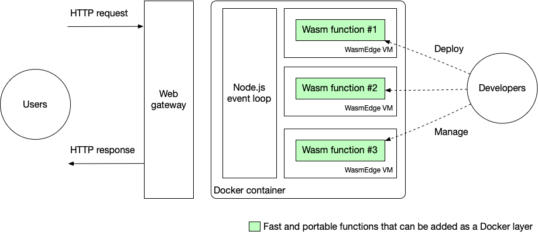
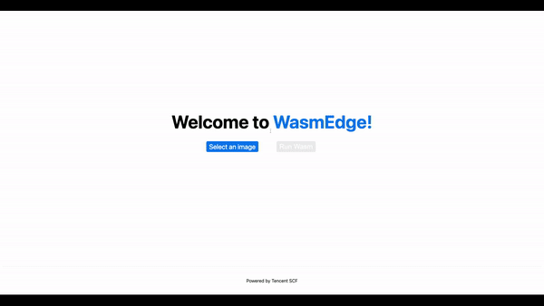
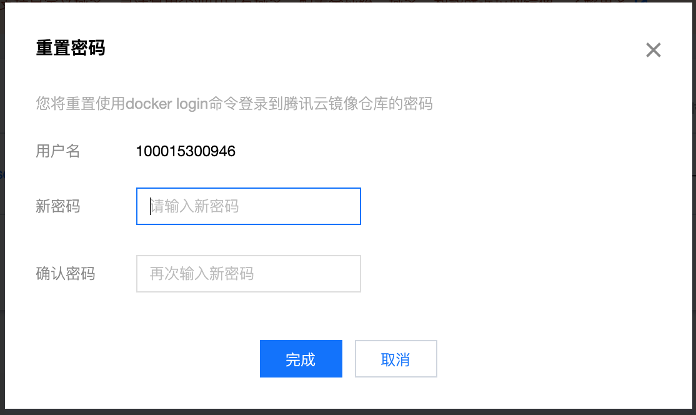
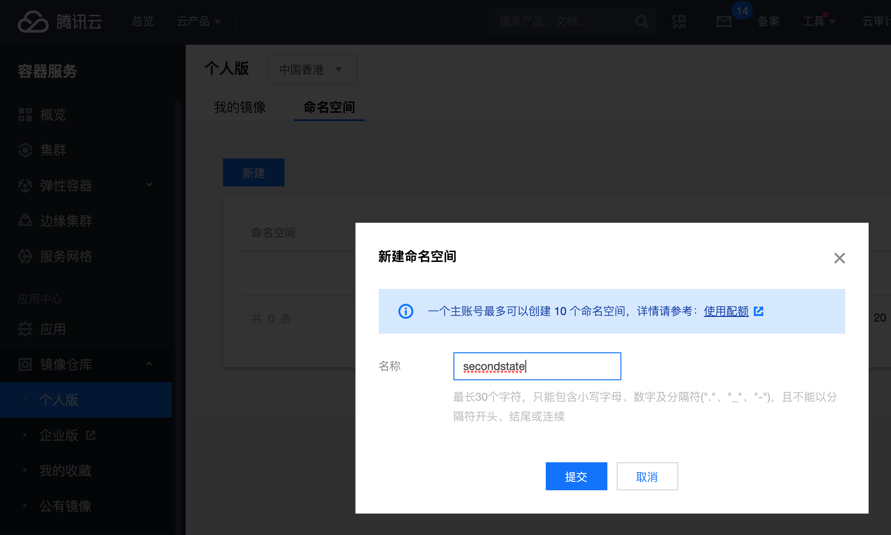
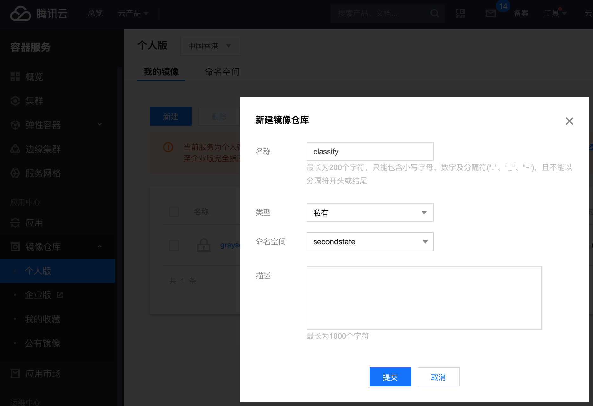
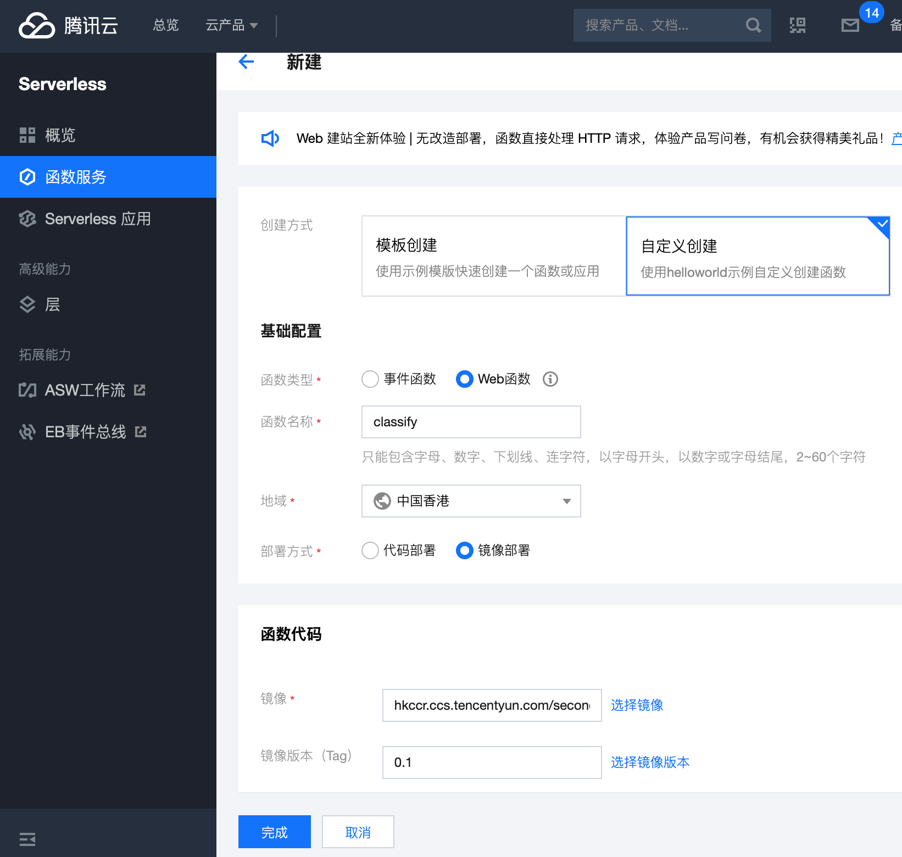
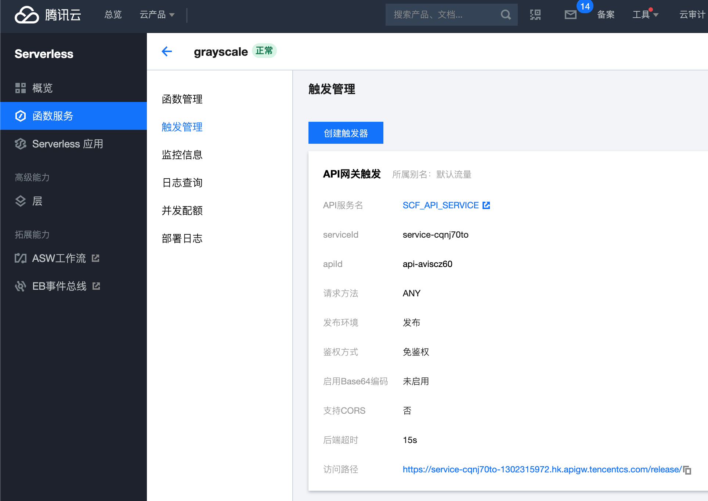

## [图像处理 Demo](https://second-state.github.io/tencent-scf-wasm-runtime/) | [Tensorflow 推理 Demo](https://juntao.github.io/tencent-scf-wasm-runtime/)

这个 repo 是一个可以 fork 的模版，让你可以快速地在腾讯云 Serverless 上部署基于 WasmEdge 的 WebAssembly 函数。这么做有几个优点。

* WebAssembly 函数可以实现接近本机编译的 C/C++ 函数的性能。
* 与本机编译的函数不同，WebAssembly 是可移植的，允许开发者在自己的机器上测试函数，并部署在任何公共云上。
* WebAssembly 比本机编译的函数更安全，因为它提供了一个沙箱。 可以在一个微服务中隔离运行多个函数。
* WasmEdge 为 Rust 开发者提供了最友好的 API 来高效安全地执行 Tensorflow 模型。

下面的架构图展现了在腾讯云 Serverless 平台上使用自定义 Docker 镜像来运行高性能的 WasmEdge 函数。 



这个模版展示了一个使用 serverless 函数的 Web 应用程序的示例，可将上传的图像转换为灰色。在 [tensorflow](https://github.com/second-state/tencent-scf-wasm-runtime/tree/tensorflow) 分支里我们有一个 AI 推理函数的例子。



## 准备工作

我们要首先在腾讯云的容器服务上建立一个容器镜像。然后我们会用这个容器镜像提供 serverless 函数服务。在腾讯云控制台上开启“容器服务”的时候需要提供一个密码。这个服务的用户名是你的腾讯云用户名。



点击“容器服务｜镜像仓库｜个人版”，新建一个“命名空间”。我把它命名为 `secondstate`。



在 `secondstate` 这个命名空间，新建一个镜像。我把它命名为 `grayscale`，因为我们这个示例函数的功能把彩色图片变得黑白。



回到你的开发机器上，用 docker login 登录你的镜像仓库。用你的刚刚创建的镜像链接就好。

```
$ docker login hkccr.ccs.tencentyun.com/secondstate/grayscale
Username:
Password:
```

## 建立我们的函数镜像

在这个模板中，我们有一个已经编译好的 WebAssembly 函数放在 [api/grayscale.wasm](api/grayscale.wasm) 文件里。这个函数的 Rust 源代码在 [api/functions/image-grayscale](api/functions/image-grayscale) 里面。它读入一个图片，然后输出这个图的黑白版。其输入与输出都是二进制数组。

而 [api/server.js](api/server.js) 这个脚本从 Web 函数的网关获得 HTTP request 的数据，传给 `grayscale.wasm` 函数执行，再把执行结果返回给 HTTP response。

我们要把 `grayscale.wasm` 与 `server.js` 以及 WasmEdge 的执行环境一起封装在一个容器镜像里面，才能后续将其部署为 serverless 函数。

```
$ cd api
$ docker build -t hkccr.ccs.tencentyun.com/secondstate/grayscale:0.1 ./
... ...
Successfully tagged hkccr.ccs.tencentyun.com/secondstate/grayscale:0.1
```

然后将这个容器镜像发布在我们刚刚建立的腾讯云容器镜像仓库里。

```
$ docker push hkccr.ccs.tencentyun.com/secondstate/grayscale:0.1
The push refers to repository [hkccr.ccs.tencentyun.com/secondstate/grayscale]
... ...
0.1: digest: sha256:... size: 3246
```

## 部署我们的 serverless 函数

下一步是在腾讯云控制台上的 serverless 函数服务里面基于我们的镜像创建函数。几点要注意的是：

* 选择“自定义创建”。
* 选择“Web函数”。
* 选择“镜像部署”。
* 在“函数代码”之中，选择你在上面建立的镜像与版本。



部署成功之后，你的 Web 函数会有一个公开的服务 URL 链接（叫做“公开访问路径”）。



这个 serverless 函数的服务 endpoints 是在 api/server.js 里面定义的。比如 /func 是指向我们的 WasmEdge 函数的。

## 前端的 web UI

这个模板有一个简单的基于 Next.js 的前端 UI。它是一个部署在 GitHub pages 上的静态网页。在 [pages/index.js](pages/index.js) 这个文件里，有一个 `env.NEXT_PUBLIC_FUNCTION_URL` 指向上面的 web 函数公开访问路径。这个 `env.NEXT_PUBLIC_FUNCTION_URL` 是在项目的 Github setting 里面设置的。

**注意**：`NEXT_PUBLIC_FUNCTION_URL` 里面应该填写的是你的*函数*的公开访问路径，需要在上一步的*服务*公开访问路径后添加 `/func`。比如，上一步中的公开访问路径是 `*.apigw.tencentcs.com/release/`，这一步中`NEXT_PUBLIC_FUNCTION_URL` 需要设置为 `*.apigw.tencentcs.com/release/func`


最后，你可以把这个网页放在任何一个支持静态网站的托管服务上。比如腾讯云的网站托管服务。只要将前端的 `env.NEXT_PUBLIC_FUNCTION_URL` 改成 serverless web 函数的公开访问路径即可。

## 开发你自己的函数

我们的 WebAssembly serverless 函数是用 Rust 开发的。这个 Rust 项目在 [api/functions](api/functions) 里面。就用 `cargo` 命令就可以编译出 [api/grayscale.wasm](api/grayscale.wasm) 文件。

```
$ cd api/functions/image-grayscale/
$ cargo build --release --target wasm32-wasi
$ cp target/wasm32-wasi/release/grayscale.wasm ../../
```

这个 [Rust 函数](api/functions/image-grayscale/src/main.rs) 从 `STDIN` 读入上传的图片，然后把黑白图片从 `STDOUT` 输出。你可以把它改成你需要的业务逻辑。

模板中的 [api/server.js](api/server.js) 将 HTTP request 与 response 与 wasmedge 联接起来。如果你改了 Rust 函数的输入与输出，你可能也要改动 [api/server.js](api/server.js) 里面的胶水代码。

修改了 [Rust 项目](api/functions/image-grayscale/) 与 [api/server.js](api/server.js) 之后，你可以重新创建与部署 Docker 镜像。新的函数就可以用了！

## 下一步

目前，我们仍然把 WasmEdge 放在腾讯云的 Docker 镜像里面运行。这虽然已经带来了巨大的好处，但是还没有完全发挥 WebAssembly 的优势。WasmEdge 可以作为一个 Docker 的替代，直接运行函数，而不是在 Docker 之中运行函数。从而大幅提高 serverless 函数的性能，降低 infrastructure 的成本！我们已经能够从 Docker 与 k8s 的管理编排工具里面启动与管理 WasmEdge 应用程序。

另外，虽然 Rust 非常适合写高性能的 serverless 函数，很多 serverless 用户希望有“低代码”的解决方案。这里，我们可以为具体应用设计“低代码”语言（DSL or Domain Specific Language）。WebAssembly 对语言编译器与解释器的广泛支持，使其特别适合运行各行各业的 DSL。例子有我们正在为飞书设计的聊天机器人语言与人工智能推理语言。

